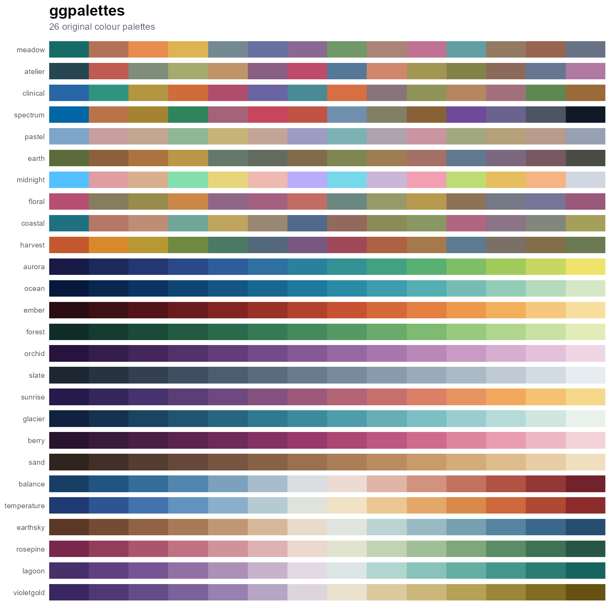

# ggpalettes

`ggpalettes` provides 26 original colour palettes and native colour/fill scales
for `ggplot2`. Its compact `pal_*()` and `scale_*()` interface will feel
familiar to users of scientific palette packages such as `ggsci`, while the
catalogue focuses on balanced, publication-ready colours for the
[ggcraft](https://github.com/YaoxiangLi/ggcraft) ecosystem.



## Installation

```r
# install.packages("pak")
pak::pak("YaoxiangLi/ggpalettes")
```

## Usage

```r
library(ggpalettes)
library(ggplot2)

gg_palette_names()
gg_palette_info(type = "sequential")

# Palette functions: pal_name()(n)
pal_meadow()(6)
pal_aurora()(12)

ggplot(iris, aes(Sepal.Length, Sepal.Width, colour = Species)) +
  geom_point(size = 3) +
  scale_colour_clinical() +
  theme_minimal()

ggplot(faithfuld, aes(waiting, eruptions, fill = density)) +
  geom_raster() +
  scale_fill_ember() +
  theme_minimal()
```

Every palette has `pal_*()`, `scale_color_*()`, `scale_colour_*()`, and
`scale_fill_*()` forms. Generic interfaces are also available:

```r
scale_colour_ggpalette("atelier")
scale_fill_ggpalette("balance")
scale_fill_ggpalette("ocean", binned = TRUE)
```

Categorical palettes default to discrete scales. Sequential and diverging
palettes default to continuous scales, so most plots need no scale-mode
argument.

## Catalogue

- Categorical: `meadow`, `atelier`, `clinical`, `spectrum`, `pastel`, `earth`,
  `midnight`, `floral`, `coastal`, and `harvest`.
- Sequential: `aurora`, `ocean`, `ember`, `forest`, `orchid`, `slate`,
  `sunrise`, `glacier`, `berry`, and `sand`.
- Diverging: `balance`, `temperature`, `earthsky`, `rosepine`, `lagoon`, and
  `violetgold`.

Use `gg_palette_plot()` to draw all or part of the catalogue. Use
`gg_palette_check()` to screen CIE Lab separation and contrast against a
selected background.

```r
gg_palette_plot(type = "diverging", n = 9)
gg_palette_check("meadow", background = "white")
```

## Development status

The public API is tested on Windows, macOS, and Linux through `R CMD check`.

## License

MIT © Yaoxiang Li
